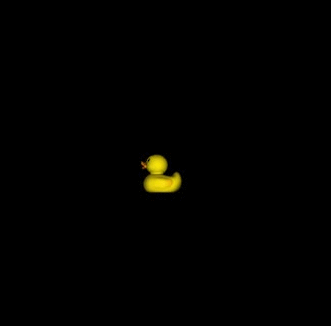
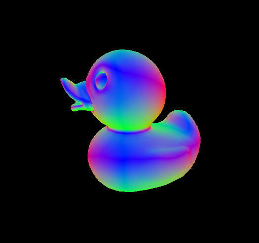
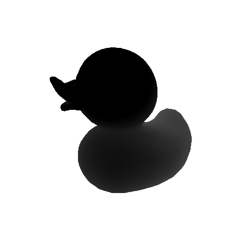
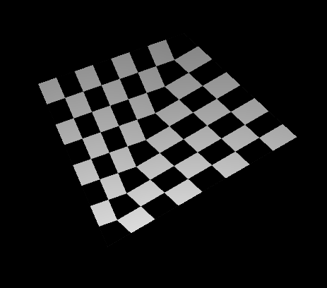
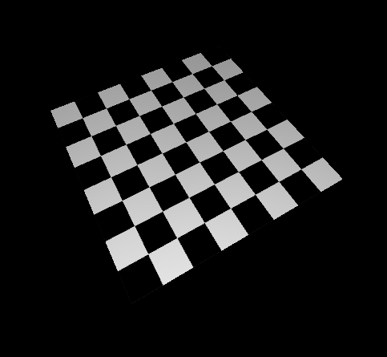
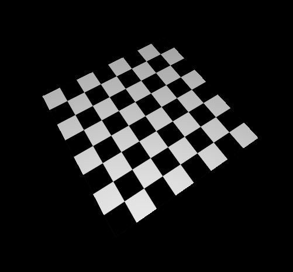
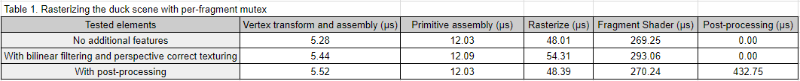
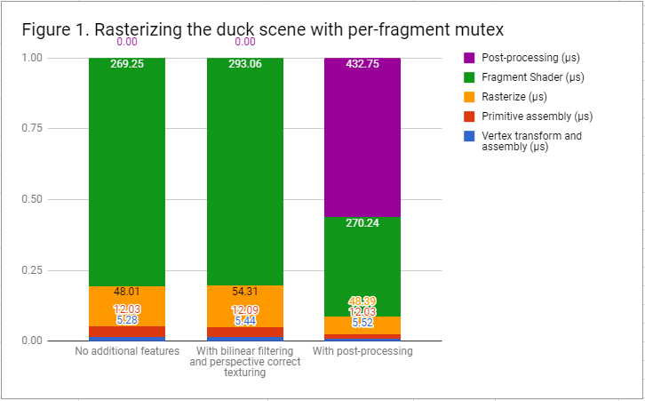

CUDA Rasterizer
===============

**University of Pennsylvania, CIS 565: GPU Programming and Architecture, Project 4**

* Mohamad Moneimne
* Tested on: Windows 10, Intel Xeon @ 3.70GHz 32GB, GTX 1070 8120MB (SigLab Computer)

### Overview

In this project, I was able to simulate the rasterization process of a GPU using CUDA. The goal of this project was to both learn the graphics pipeline more intimately while also gaining an appreciation for the GPU's existing rasterization capabilities. The pipeline seen here is a fairly simple one, including vertex input assembly, vertex shading, primitive assembly, rasterization, fragment shading, and post-processing on triangles.

### Interpolating values

Once the attributes have been passed in for assembly and transformed in the vertex shader, barycentric coordinates are used to interpolate several per-vertex attributes for use in the the fragment shader. This occurs in the rasterization stage, yielding interpolated values for positions, normals, texture coordinates, colors, and depth. We can use the output color as a way to show debug views of our rasterizer.

 Normal values

 Depth values

### Texture Mapping

When interpolating texture coordinates regularly with barycentric coordinates, bending artifacts can be seen in the rendered results because we aren't taking into acount _perspective correctness__. This can be seen here in a render of a checkerboard.

Once we take into account the depth values of interpolated positions on the triangles, the texture coordinates become correct with the perspective transform. With this, we fix the artifacts!

A final improvement we can make upon this feature can be seen in the aliasing along the edges of the checkerboard squares. These artifacts appear because we are sampling a texture using a single float point on the texture. The GPU typically fixes this by doing _bilinear filtering_. With this filtering, we interpolate between the color values at four neighbors around our texture sample, relieving us from the jagged edges.

### Post-Processing

Another interesting feature I added is a post-processing stage that applies a Gaussian blur over the rendered image. I achieve this by doing a [two-pass approach](https://learnopengl.com/#!Advanced-Lighting/Bloom), which blurs across all rows then across all columns separately. This algorithm naturally lends itself to using shared memory in a blurring kernel. We can launch a kernel that processes each row as a separate block. The threads within these blocks are loaded into shared memory and a convolution mask is applied to each element of the row. We benefit from using shared memory here because we are reading from every element multiple times in a single convolution (up to the size of the mask). The same is done in a second pass, but while processing each column.

### Performance Analysis

To analyze the performance of this rasterizer, I broke down the different stages into groups and tested the relative amount of time taken for each stage with respect to the features I added.

**No additional features**

To begin with, let's analyze the performance of the rasterizer without any of the additional features described above. We can instantly see that a majority of the time in our pipeline is spent in the fragment shading stage as compared to the previous per-vertex stages. This is expected in the duck scene since there are many more fragments than triangles being processed at a time. This leads us to spend more time shading our scene per-fragment. 

Another observation we can make is that rasterization takes relatively longer than the previous stages. This is likely because of our use of mutexes during rasterization. We need a mutex per-fragment so that we are only updating a given position in the depth and fragment buffers serially. This leads us to remove some of the parallelization while rasterizing. Also, by iterating over all of the potential fragments generated within the bounding box of each primitive, we are doing many more operations in the rasterization stage than in the stages before.

**With bilinear filtering and perspective correct texturing**

We can see that there is a slight increase in rasterization time (where perspective correct texture coordinates are created) and in the fragment shader (where bilinear filtering occurs). This makes sense since we are simply adding more computation time per fragment, but it seems that there isn't much of an overhead here.

**Post-processing**

It can be instantly seen in these results that post-processing with a Gaussian blur takes about half of the rendering time in the pipeline. We could expect that it would take at least as much time as fragment shading since we are operating on a per-pixel basis, but Gaussian blur actually does more work than this. For each pixel, we are creating a new blurred value based on the weighted average of each element within a covolution mask radius of 5 elements. This would ordinarily mean that we are repeatedly reading the same values from global memory, but pre-loading our values into shared memory leads to less of an overhead when reading repeated values.

### Credits

* [tinygltfloader](https://github.com/syoyo/tinygltfloader) by [@soyoyo](https://github.com/syoyo)
* [glTF Sample Models](https://github.com/KhronosGroup/glTF/blob/master/sampleModels/README.md)
